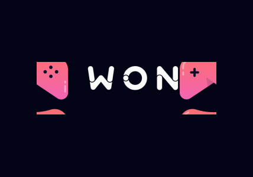
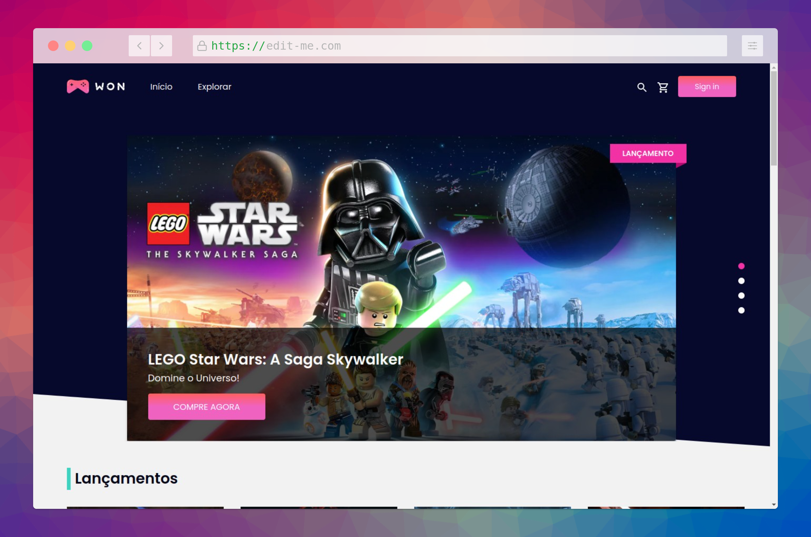
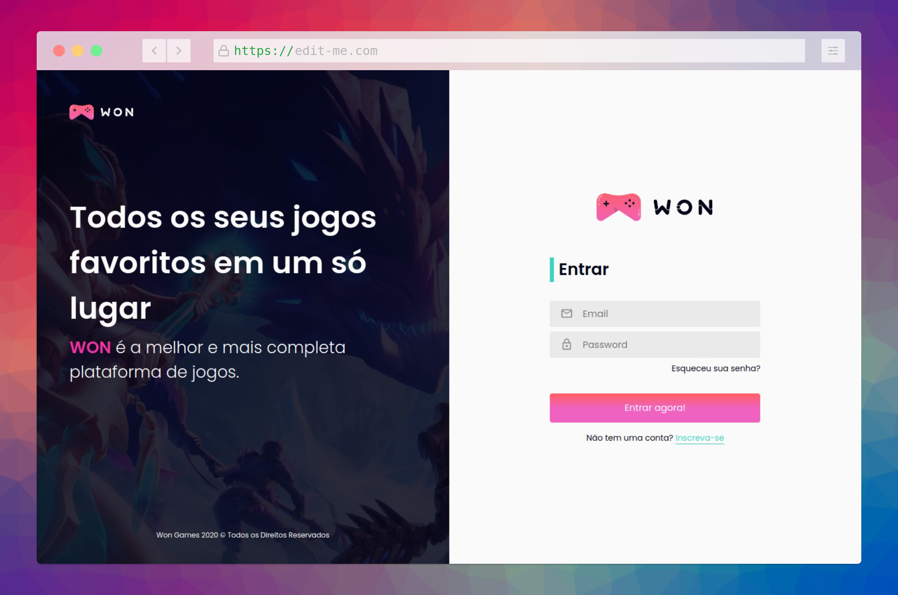

<div id="top"></div>

<!-- PROJECT SHIELDS -->
<!--
*** I'm using markdown "reference style" links for readability.
*** Reference links are enclosed in brackets [ ] instead of parentheses ( ).
*** See the bottom of this document for the declaration of the reference variables
*** for contributors-url, forks-url, etc. This is an optional, concise syntax you may use.
*** https://www.markdownguide.org/basic-syntax/#reference-style-links
-->

<!-- [![Contributors][contributors-shield]][contributors-url]
[![Forks][forks-shield]][forks-url]
[![Stargazers][stars-shield]][stars-url]
[![Issues][issues-shield]][issues-url]
[![MIT License][license-shield]][license-url]
[![LinkedIn][linkedin-shield]][linkedin-url] -->

<!-- PROJECT LOGO -->
<br />
<div align="center">
    <a href="http://wongames-client-drab.vercel.app/">
      
    </a>
  <h3 align="center">WON Games -Todos os seus jogos favoritos em um só lugar</h3>

  <p align="center">
    <a href="http://wongames-client-drab.vercel.app/">Conheça a Won</a>
    ·
    <a href="https://github.com/hugolima03/wongames-client/issues">Reportar Bugs</a>
    ·
    <a href="https://github.com/hugolima03/wongames-client/issues">Sugestões</a>
  </p>
</div>

<details>
  <summary>Conteúdos</summary>
  <ol>
    <li>
      <a href="#sobre-o-projeto">Sobre o projeto</a>
    </li>
    <li>
      <a href="#tecnologias">Tecnologias</a>
    </li>
    <li>
      <a href="#principais-features">Principais Features</a>
    </li>
    <li><a href="#executando-o-projeto">Executando o projeto</a></li>
    <li><a href="#comandos">Comandos</a></li>
    <li><a href="#contribuindo">Contribuindo</a></li>
    <li><a href="#contato">Contato</a></li>
  </ol>
</details>

## Sobre o projeto

<div align="center">
  
  
</div>

A Won Games é uma plataforma e-commerce de jogos desenvolvida utilizando as melhores ferramentas e práticas do mercado. Com suporte a pagamentos e área do cliente, a Won Games utiliza como principal tecnologias o NextJS, Strapi, GraphQL e muito mais! Foi construída durante o curso de React Avançado, onde fui mentorado pelos professores Willian Justen e Guilherme Louro.

Motivações:

- Desenvolver uma aplicação real e escalável com técnicas e aplicações altamente competitivas no mercado.
- Fortalecer os conhecimentos em Desenvolvimento Front-End com ReactJS e NextJS.
- Implementar o funcionamento de fluxos complexos, como de pagamento online, CI, CD e deploy com ferramentas da AWS.
- Aplicar meus estudos sobre testes automatizados no Front-End, utilizando principalmente Jest para testes unitários e Cypress para os testes de integração e E2E.

A principal preocupação no desenvolvimento da Won Games foi a construção de um ambiente de desenvolvimento altamente escalável, que utiliza desde scripts de pre-commits para assegurar os estilo de código do projeto, aplicação de testes automatizados em todos os componentes da aplicação e nos fluxos mais essenciais, como o fluxo de pagamento, de compra de um produto e documentação de componentes do DesignSystem com Storybook.

<p align="right">(<a href="#top">voltar para o topo</a>)</p>

## Tecnologias

- [Next.js](https://nextjs.org/)
- [React.js](https://reactjs.org/)
- [Typescript](https://www.typescriptlang.org/)
- [Strapi](https://strapi.io/)
- [Apollo](https://www.apollographql.com/)
- [GraphQL](https://graphql.org/)
- [React Testing Library](https://testing-library.com/)
- [Storybook](https://storybook.js.org/)
- [Cypress](https://www.cypress.io/)

<p align="right">(<a href="#top">voltar para o topo</a>)</p>

## Principais Features

- Integrado com gateway de pagamentos Stripe
- Geração de páginas com SSG e SSR.
- Área do cliente, com lista de desejos, compras anteriores e etc.
- Cadastro e Autenticação de clientes.
- Listagem e filtro de jogos.
- Carrinho
- Envio de E-mail

<p align="right">(<a href="#top">voltar para o topo</a>)</p>

## Executando o projeto

É necessário ter o NodeJS instalado na máquina.

1.Instalando NPM packages

```sh
npm install
#ou
yarn install
```

2.Init dev server

```sh
npm dev
#ou
yarn dev
```

<p align="right">(<a href="#top">voltar para o topo</a>)</p>

## Comandos

```sh
  yarn dev #inicia o servidor de desenvolvimento.
  yarn build #gera o build do nextjs.
  yarn start #inicia um ambiente de produção através do build gerado pelo comando anterior.
  yarn lint #inicia o linter
  yarn typecheck #verificação de tipos do Typescript
  yarn test:watch #inicia os testes no modo watch
  yarn test:e2e #inicia o ambiente de desenvolvimento e o cypress
  yarn storybook #inicia o storybook
```

## Contribuindo

As contribuições são o que tornam a comunidade de código aberto um lugar incrível para aprender, inspirar e criar. Quaisquer contribuições que você fizer são **muito apreciadas**.

Se você tiver uma sugestão para melhorar isso, faça um fork do repositório e crie uma solicitação pull. Você também pode simplesmente abrir um problema com a tag "melhoria".
Não se esqueça de dar uma estrela ao projeto! Obrigado novamente!

1. Fork the Project
2. Create your Feature Branch (`git checkout -b feature/AmazingFeature`)
3. Commit your Changes (`git commit -m 'Add some AmazingFeature'`)
4. Push to the Branch (`git push origin feature/AmazingFeature`)
5. Open a Pull Request

<p align="right">(<a href="#top">voltar para o topo</a>)</p>

<!-- CONTACT -->

## Contato

Hugo Lima Romão - hugo8romao@gmail.com

Project Link: [https://github.com/hugolima03/wongames-client](https://github.com/hugolima03/wongames-client)

<p align="right">(<a href="#top">voltar para o topo</a>)</p>
